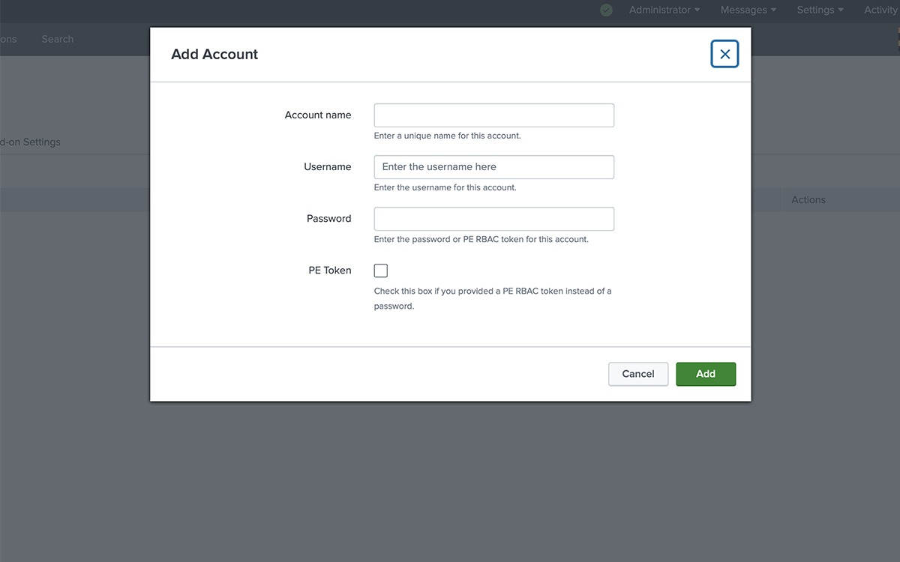
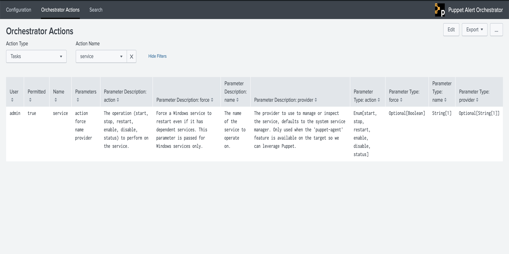
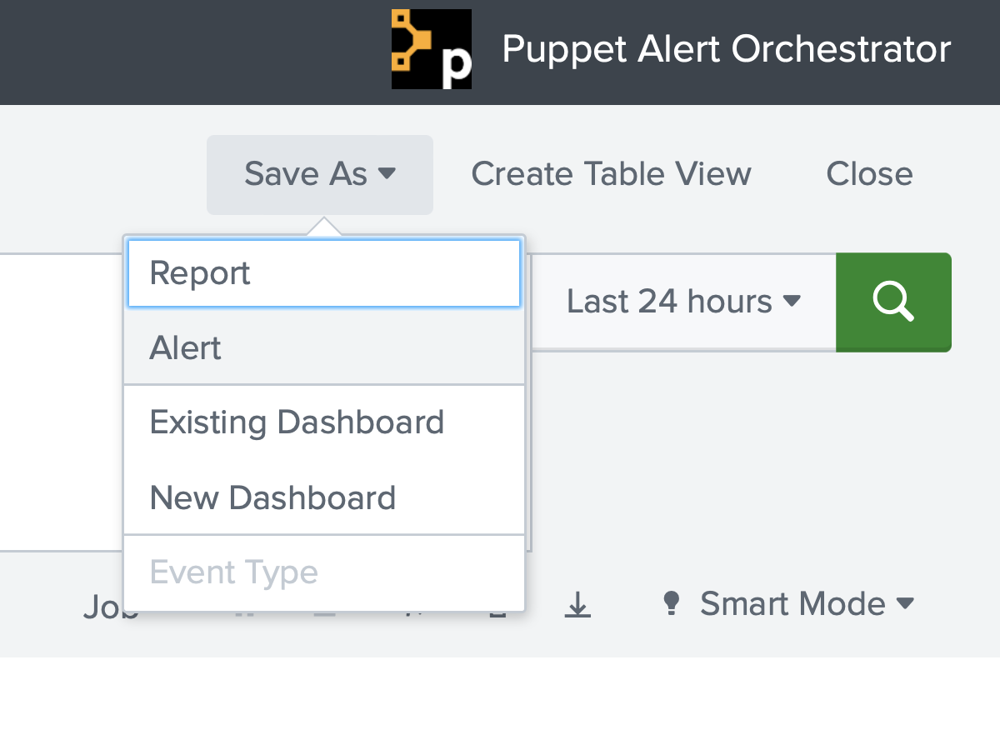
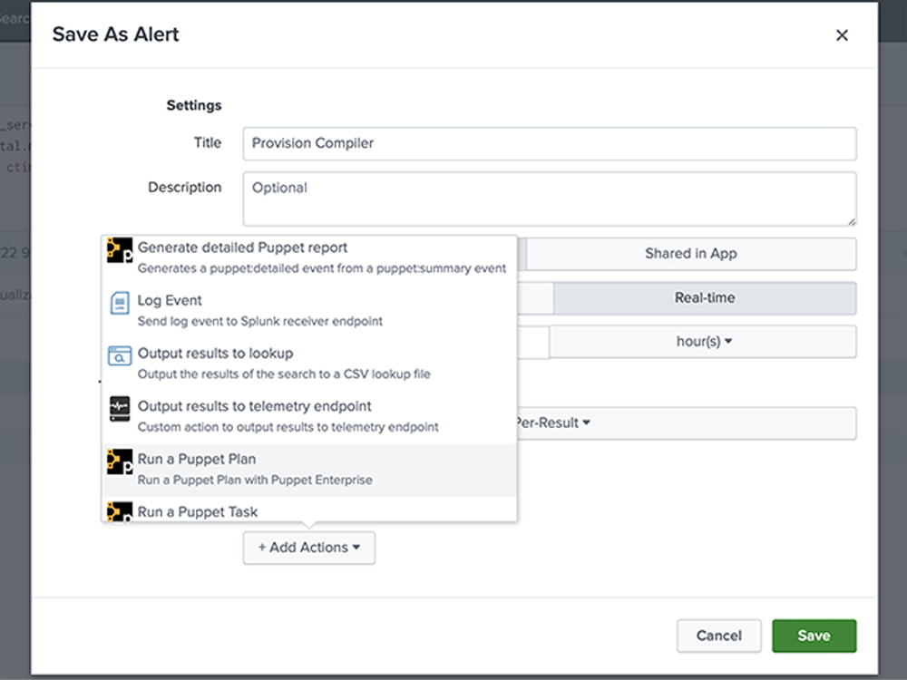

# Puppet Alert Orchestrator

##### Table of Contents

1. [Description](#description)
2. [Configuration](#configuration)
3. [Orchestrator Actions](#orchestrator-actions)
4. [Usage](#usage)
5. [Examples](#example-searches)
6. [Troubleshooting](#troubleshooting-and-verification)

## Description

This Splunk add-on can be used to trigger Puppet Enterprise Orchestration actions such as plan or task execution; as well as generating detailed Puppet report data.

This add-on is intended to be used alongside the [Puppet Report Viewer](https://splunkbase.splunk.com/app/4413/), with data provided by the [splunk_hec](https://forge.puppet.com/puppetlabs/splunk_hec) report processor available on the Puppet Forge.

## Configuration

After installing and configuring both the `splunk_hec` Puppet module and the Puppet Report Viewer app for Splunk; follow the steps below to configure the [Puppet Alert Orchestrator add-on for Splunk](https://github.com/puppetlabs/TA-puppet-alert-orchestrator):

### Configuration Tabs

#### Account

Add account details for multiple PE RBAC users.

  * **Account name**: Descriptive Account Name
  * **Username**: PE RBAC Username
  * **Password**: Password _or_ PE RBAC Token
    * Check the `pe_token` checkbox if you provide a PE RBAC Token instead of a password. 



#### Logging

Default log level is `INFO`.


#### Add-on settings

The following are required fields.

  * **Puppet Enterprise Console**: URL for the default PE Console.
  * **Splunk HEC Token**: The HEC Token generated for the Puppet Report Viewer.
  * **Splunk HEC URL**: (e.g. `https://http-inputs-<$host>.splunkcloud.com:443/services/collector`)
  * **User**: Username for the default account to be used to trigger actions in PE.

**Note**: See the [Splunk HEC Documentation](https://docs.splunk.com/Documentation/Splunk/latest/Data/UsetheHTTPEventCollector) for details on determining the correct URL for your HEC endpoint. 
	


**Note**: Once the add-on has been configured, Splunk will need to be restarted.

## Orchestrator Actions

The Orchestrator Actions dashboard is powered by a custom input script which utilizes the configured account credentials to query Puppet Enterprise for Tasks and Plans available to that particular RBAC user.



#### Splunk Cloud

The Puppet Enteprise Console URL and Orchestration Services port (**default**: `8143`) need to be added to the [outbound port configuration](https://docs.splunk.com/Documentation/SplunkCloud/latest/Config/ConfigureOutboundPorts). If this is not completed, you will see the following error in the `splunkd` log:

```
ERROR ExecProcessor [28983 ExecProcessor] - message from “/opt/splunk/bin/python3.7 /opt/splunk/etc/apps/TA-puppet-alert-orchestrator/bin/inputs/orchestrator_actions.py” TA-puppet-alert-orchestrator: Failed to build event message - HTTPSConnectionPool(host=‘PE_CONSOLE_URL’, port=8143): Max retries exceeded with url: /orchestrator/v1/tasks (Caused by NewConnectionError(‘<urllib3.connection.HTTPSConnection object at 0x7f30adc1df10>: Failed to establish a new connection: [Errno 110] Connection timed out’))
```

**Notes**:

> * By default the custom input script only checks the `production` environment. As a user can override the default environment when configuring the action, they can also input a custom Plan or Task name that may not be listed in the default environment.

> * This add-on has **only** been tested on the [Victoria Experience](https://docs.splunk.com/Documentation/SplunkCloud/latest/Admin/Experience) of Splunk Cloud. To utilize this add-on with the Classic Experience, your installation will need to include an [Inputs Data Manager (IDM)](https://docs.splunk.com/Documentation/SplunkCloud/latest/Admin/Intro#Splunk_Cloud_Platform_features).

#### Splunk Enterprise

The interval (**default**: `60m`) at which the input script runs is configurable **only** within Splunk Enterprise by adding the following to a local `inputs.conf` file for the add-on:

```
[script://./bin/inputs/orchestrator_actions.py]
# 12h interval
interval = 43200
# To specify a cron schedule, use the following format:
# "<minute> <hour> <day of month> <month> <day of week>"
```

## Usage

Once the add-on has been properly configured you can begin creating new Alerts to trigger specified actions (e.g. Run a Puppet Plan, Run a Puppet Task, Generate a detailed Puppet report) when a new event matching the Alert is received by Splunk.

1. Create a Splunk search:

	
	
2. Save the search as an Alert:

	

3. Configure the Alert Actions:

	
	
## Example Searches

Examples assume you are also utilizing the Puppet Report Viewer app in conjunction with the `splunk_hec`, `pe_event_forwarding`, and `puppet_metrics_collector` Puppet modules.

**Action**: Generate a detailed report when the report status has changed.

**Search**:

```
index=main sourcetype=puppet:summary status=changed
```

---

**Action**: Run Puppet plan `enterprise_tasks::provision_compiler` when the JRuby pool drops below **2**.

**Search**:

```
index=main sourcetype=puppet:metrics pe_service=puppetserver
| rename jruby-metrics.status.experimental.metrics.average-free-jrubies as jrb
| bin _time AS "TIME" span=5m | convert ctime(TIME)
| stats sum(jrb) as JRuby_Pool by TIME
| where ceil(JRuby_Pool) < 2
```

---

**Action**: Run a custom Puppet task to revoke an RBAC users status when a specific node group is edited.

**Search**:

```
index=main sourcetype="puppet:activities_classifier"
| search "objects{}.name"="PE Master"
```

## Troubleshooting and Verification

#### Splunk Cloud

To check the logs of the individual Alerts you can search the internal log index in Splunk with the following search:

```
index=_internal sourcetype=splunkd component=sendmodalert action=puppet_*
```

#### Splunk Enterprise

The following logs can be reviewed from the Splunk server:

  * `$SPLUNK_HOME/var/log/splunk/puppet_generate_detailed_report_modalert.log`
  * `$SPLUNK_HOME/var/log/splunk/puppet_run_plan_modalert.log`
  * `$SPLUNK_HOME/var/log/splunk/puppet_run_task_modalert.log`
  * `$SPLUNK_HOME/var/log/splunk/splunkd.log`

**Note**: Error message verbosity depends on the log level of your installation.

##### Binary File Declaration

```
bin/ta_puppet_alert_actions/aob_py3/pvectorc.cpython-37m-x86_64-linux-gnu.so: this file does not require any source code
bin/ta_puppet_alert_actions/aob_py3/setuptools/cli.exe: this file does not require any source code
bin/ta_puppet_alert_actions/aob_py3/setuptools/cli-32.exe: this file does not require any source code
bin/ta_puppet_alert_actions/aob_py3/setuptools/cli-64.exe: this file does not require any source code
bin/ta_puppet_alert_actions/aob_py3/setuptools/gui.exe: this file does not require any source code
bin/ta_puppet_alert_actions/aob_py3/setuptools/gui-32.exe: this file does not require any source code
bin/ta_puppet_alert_actions/aob_py3/setuptools/gui-64.exe: this file does not require any source code
```